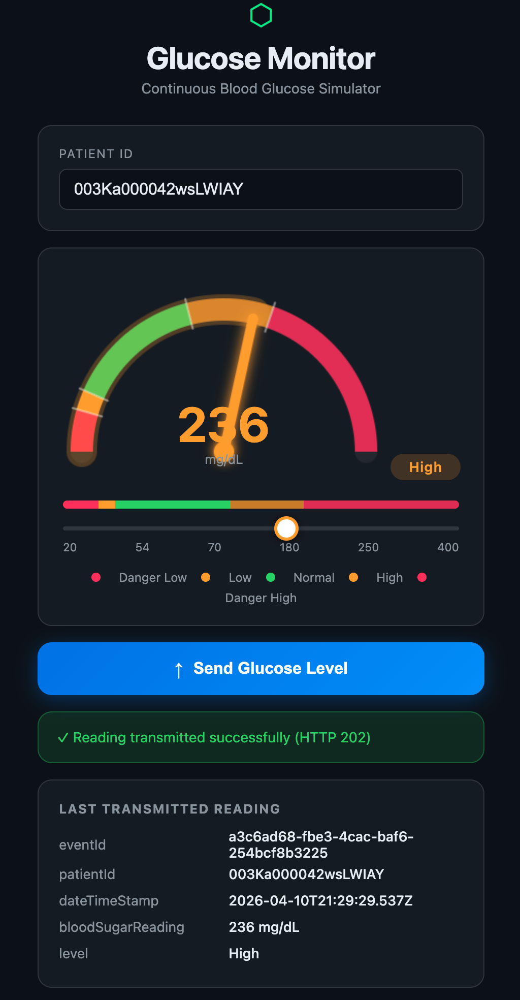
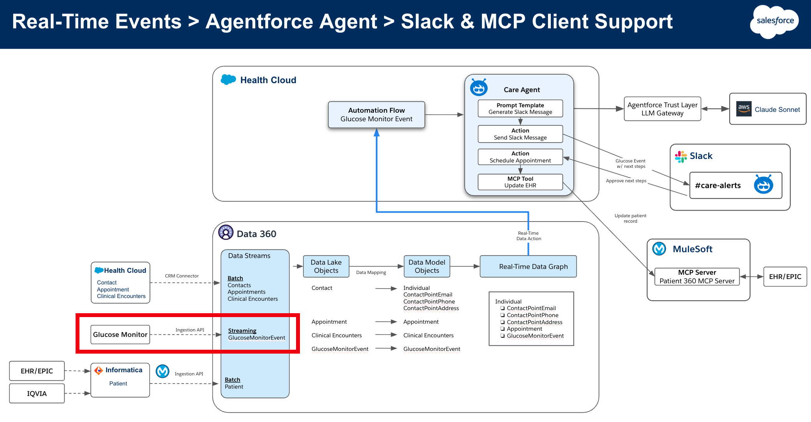

# patient360-glucose-monitor

A web app that simulates a continuous glucose monitor (CGM) and streams readings into **Salesforce Data Cloud** via the real-time Ingestion API. Built as part of the **Patient 360 / TDX26** demo showcasing real-time healthcare events flowing through Data Cloud into an Agentforce agent.

<p align="center">
  
</p>

## What it does

A clinician (or a simulated device) drags the slider to set a blood glucose reading between 20 and 400 mg/dL. The browser classifies the reading into a clinical level — `Dangerously Low`, `Low`, `Normal`, `High`, `Dangerously High` — and submits it. The Express backend authenticates to Salesforce, exchanges the access token for a Data Cloud-specific token, and POSTs the event to the Data Cloud Ingestion API.

From there the event flows into a streaming Data Lake Object, gets unified onto the patient's Real-Time Data Graph, and triggers an Agentforce agent that can take action (e.g. post a `#care-alerts` message in Slack, schedule an appointment, or update the EHR).

## Architecture



The glucose monitor (highlighted in red) is one of several streaming sources feeding **Data 360**. Other inputs come from Health Cloud, EHR/EPIC, IQVIA, and Informatica via batch and streaming ingestion. Once an event reaches the Real-Time Data Graph, the Care Agent — built on Agentforce and powered by Claude via the Salesforce Trust Layer / LLM Gateway — decides what action to take. Slack and the Patient 360 MCP Server (over MuleSoft) are downstream consumers.

## Quickstart

```bash
git clone https://github.com/congmingwudi/patient360-glucose-monitor.git
cd patient360-glucose-monitor
npm install
cp .env.example .env       # then fill in your Salesforce Connected App credentials
npm run dev                # nodemon, auto-reloads on changes
```

Then open <http://localhost:3000>.

### Run with Docker

```bash
docker-compose up          # builds and runs on :3000, reads .env
```

## Environment variables

Copy `.env.example` to `.env` and fill in:

| Variable | Purpose |
|---|---|
| `SF_CLIENT_ID` | Salesforce Connected App client ID (Client Credentials flow enabled) |
| `SF_CLIENT_SECRET` | Salesforce Connected App client secret |
| `SF_TOKEN_URL` | Salesforce OAuth token endpoint, e.g. `https://<myorg>.my.salesforce.com/services/oauth2/token` |
| `SF_DATA_CLOUD_URL` | Data Cloud tenant base URL, e.g. `https://<tenant>.c360a.salesforce.com` |
| `SF_INGESTION_SOURCE` | Data Cloud Ingestion API source (connector) name |
| `DEFAULT_PATIENT_ID` | Patient ID pre-filled in the UI |
| `PORT` | Web server port (default `3000`) |

## How the auth dance works

The Data Cloud Ingestion API requires a tenant-specific token, not a plain Salesforce access token. The server performs a two-step OAuth2 flow on demand and caches the result in memory:

1. **Client Credentials grant** against `SF_TOKEN_URL` → standard Salesforce access token + `instance_url`.
2. **Token exchange** (`urn:salesforce:grant-type:external:cdp`) against `${instance_url}/services/a360/token` → Data Cloud tenant token.

The token is cached until 90% of its lifetime, and invalidated immediately on any 401/403 from the Ingestion call.

## Event schema

The OpenAPI definition for the `GlucoseMonitorEvent` object lives in [`data360-ingestion-api-schema/`](data360-ingestion-api-schema/):

- **`GlucoseMonitorEvent.yaml`** — hand-authored schema used to define the Data Cloud object.
- **`glucosemonitorevent_object_endpoints_*.yaml`** — auto-generated by Data Cloud after the source is created; documents the live ingestion endpoints.

| Field | Type | Notes |
|---|---|---|
| `eventId` | UUID v4 | Generated by the server; used as Data Cloud dedup key |
| `patientId` | string | Unique patient identifier |
| `dateTimeStamp` | ISO 8601 UTC | Stamped server-side |
| `bloodSugarReading` | number (mg/dL) | 20 – 400 in the UI |
| `level` | enum | `Dangerously Low` / `Low` / `Normal` / `High` / `Dangerously High` |

### Level thresholds (mg/dL)

| Level | Range |
|---|---|
| Dangerously Low | < 54 |
| Low | 54 – 69 |
| Normal | 70 – 180 |
| High | 181 – 250 |
| Dangerously High | > 250 |

## Stack

Node.js 20 · Express · Axios · vanilla JS + HTML5 Canvas (no build step) · Docker / docker-compose
